# Transaction Fraud Detection System

A production-ready Machine Learning system that detects fraudulent financial transactions using **XGBoost**, **Feature Engineering**, **SHAP Explainability**, **Flask REST API**, and an interactive **Streamlit Dashboard**.

The project demonstrates an end-to-end ML workflow covering data preprocessing, feature engineering, model training, explainability, API development, dashboard creation, Dockerization, and cloud deployment.

---

# Live Demo

### Streamlit Dashboard
[Launch Dashboard](https://swati668-fraud-detection-system-streamlit-appapp-aj3ez4.streamlit.app)

### Flask API
[Open API](https://fraud-detection-api-dzc8.onrender.com)

### Health Endpoint
[Check API Health](https://fraud-detection-api-dzc8.onrender.com/health)

---

# System Architecture

User
   ↓
Streamlit Dashboard
   ↓
Flask REST API
   ↓
Input Validation
   ↓
Feature Engineering Pipeline
   ↓
XGBoost Fraud Detection Model
   ↓
Fraud Risk Prediction
   ↓
Results & Explainability

---

# Project Highlights

* End-to-end Machine Learning system
* XGBoost-based fraud detection model
* Advanced feature engineering pipeline
* SHAP explainability integration
* Flask REST API for real-time inference
* Streamlit dashboard for interactive analysis
* Batch and single transaction prediction
* Dockerized deployment
* Cloud deployment using Render and Streamlit Community Cloud
* Automated API testing

---

# Business Problem

Financial fraud causes significant losses to banks, businesses, and customers.

The objective of this project is to identify fraudulent transactions early and accurately while minimizing false alarms. The system is designed to help fraud detection teams prioritize high-risk transactions and reduce financial losses.

---

# Solution Approach

1. Data cleaning and preprocessing
2. Exploratory Data Analysis (EDA)
3. Feature engineering
4. Model training and evaluation
5. Hyperparameter tuning
6. Model selection
7. SHAP-based explainability
8. REST API development
9. Streamlit dashboard development
10. Dockerization and deployment

---

# Model Performance

XGBoost was selected as the final production model.

| Metric            | Score  |
| ----------------- | ------ |
| ROC-AUC           | 0.9998 |
| PR-AUC            | 0.9326 |
| Balanced Accuracy | 0.93   |
| Precision         | 0.892  |
| Recall            | 0.860  |
| F1 Score          | 0.876  |

---

# Model Evaluation

### ROC Curve & Precision-Recall Curve

<div align="center">
  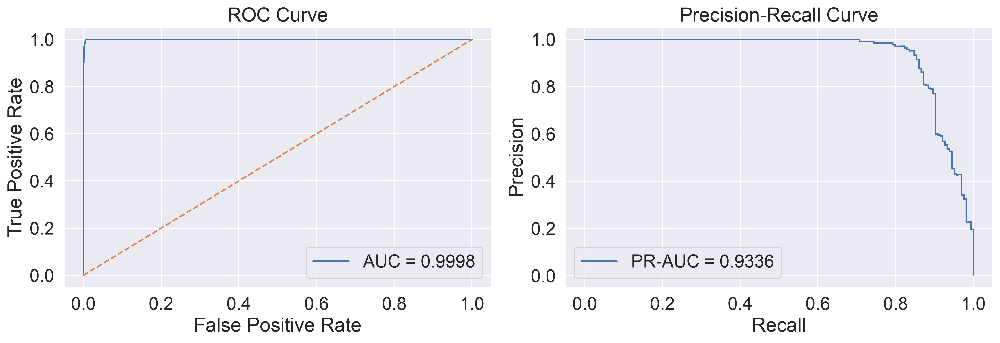
</div>

These evaluation metrics demonstrate strong fraud detection capability while maintaining a balance between precision and recall.

---

# Model Explainability (SHAP)

### SHAP Summary Plot

<div align="center">
  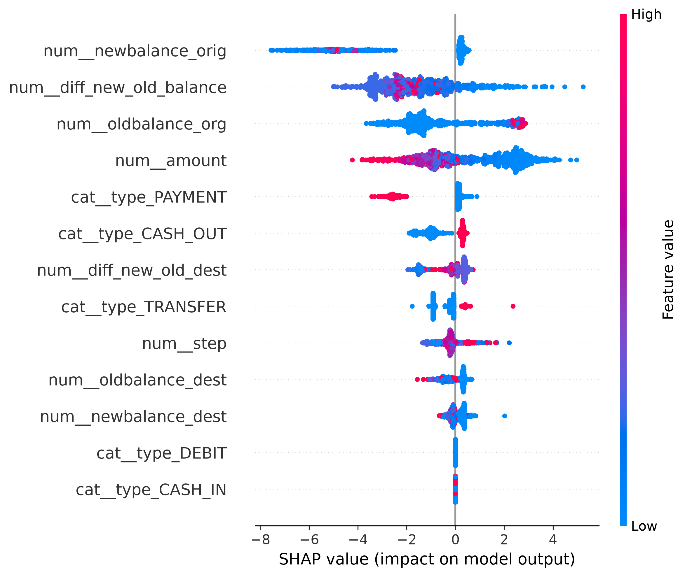
</div>

### SHAP Feature Importance

<div align="center">
  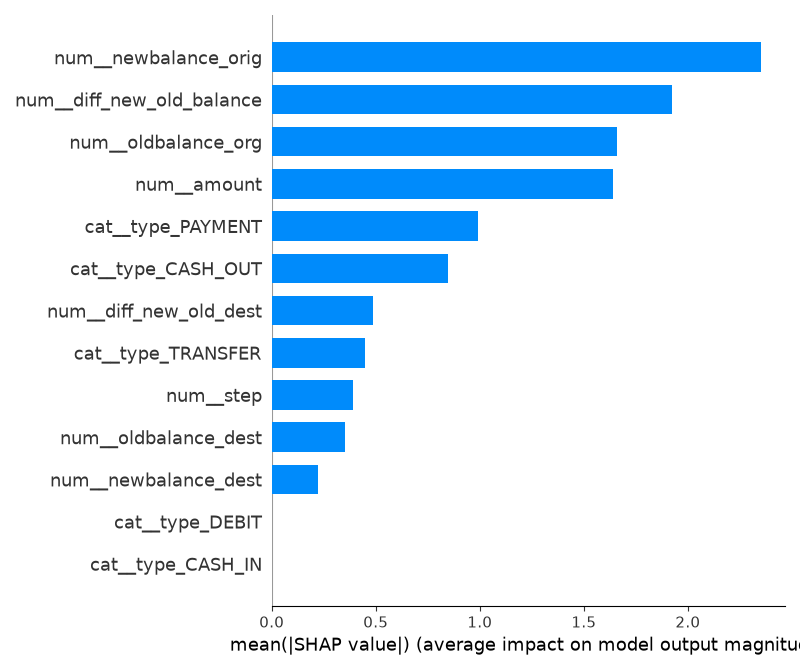
</div>

SHAP helps explain:

* Which features influence fraud detection most
* Why a transaction was classified as fraudulent
* Model behavior and transparency
* Decision-making patterns for stakeholders

---

# Interactive Streamlit Dashboard

The project includes a production-ready Streamlit dashboard connected to the deployed Flask API for real-time fraud analysis.

## Dashboard Features

### Home Page

* Project overview
* System architecture

### Single Prediction

* Enter transaction details manually
* Receive fraud probability score
* View fraud classification and risk level
* Real-time API prediction

### Batch Prediction

* Upload CSV files
* Predict multiple transactions simultaneously
* Download prediction results

### Analytics Dashboard

* Fraud vs legitimate transaction analysis
* Risk level distribution
* Transaction type analysis
* Fraud probability trends
* High-risk transaction reporting

---

## Dashboard Screenshots

### Home Page

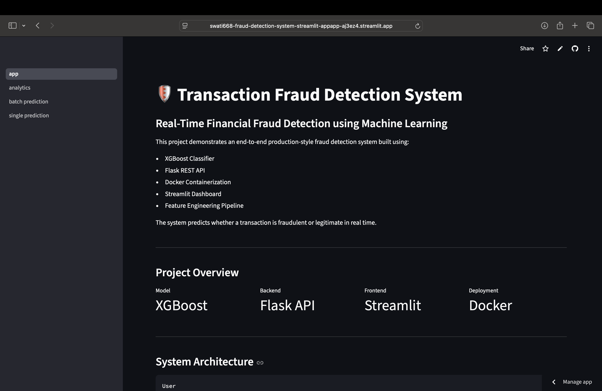

### Single Prediction

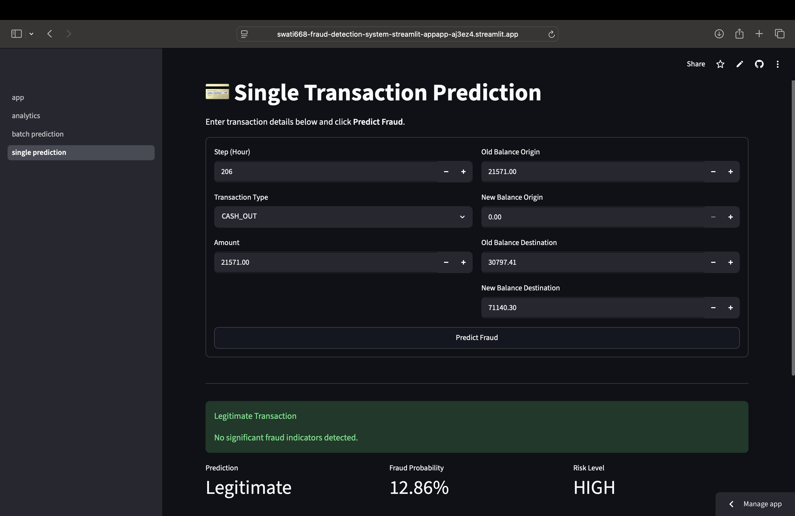

### Batch Prediction

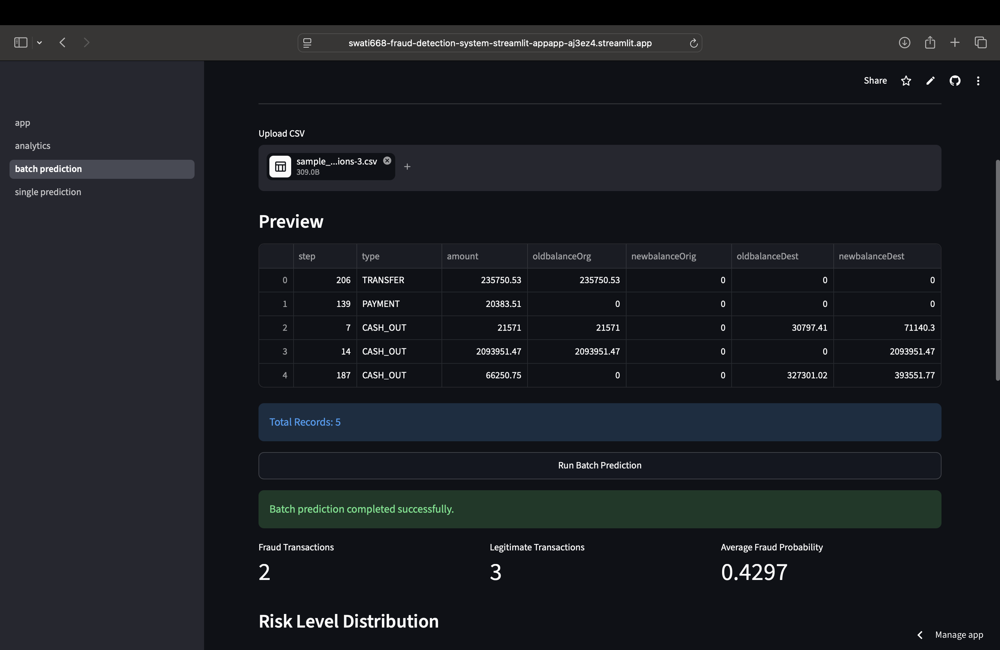

### Analytics Dashboard

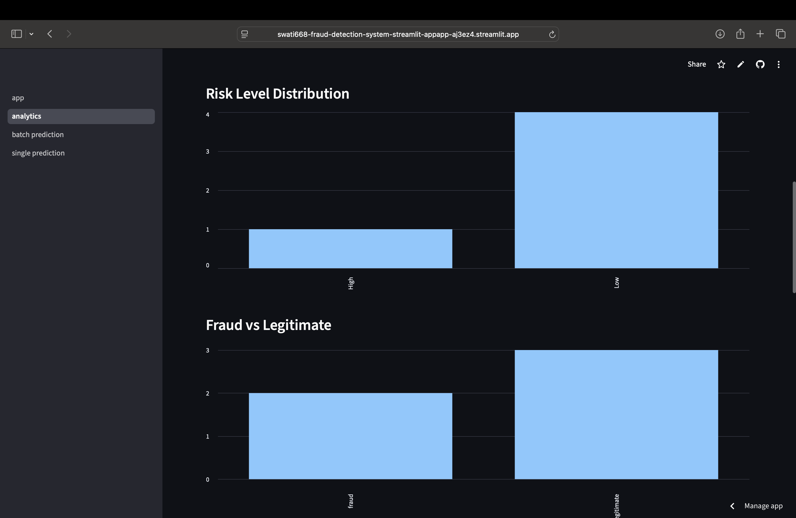

---

# API Endpoints

## Health Check

```http
GET /health
```

---

## Fraud Prediction

```http
POST /fraud/predict
```

### Example Request

```json
{
  "step": 1,
  "type": "CASH_OUT",
  "amount": 5000,
  "oldbalanceOrg": 10000,
  "newbalanceOrig": 5000,
  "oldbalanceDest": 0,
  "newbalanceDest": 5000
}
```

### Example Response

```json
{
  "prediction": 1,
  "fraud_probability": 0.87,
  "risk_level": "High"
}
```

---

## Batch Prediction

```http
POST /fraud/predict
```

Supports multiple transactions in a single request and returns prediction results with fraud probabilities and risk levels.

---

# API Testing Screenshots

### Health Check

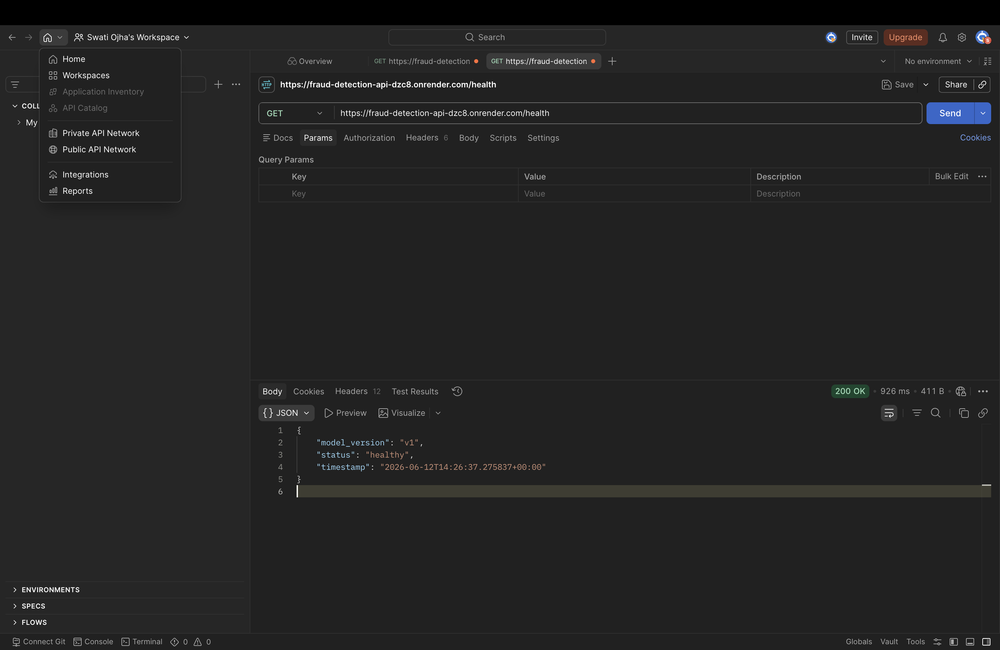

### Single Prediction API Test

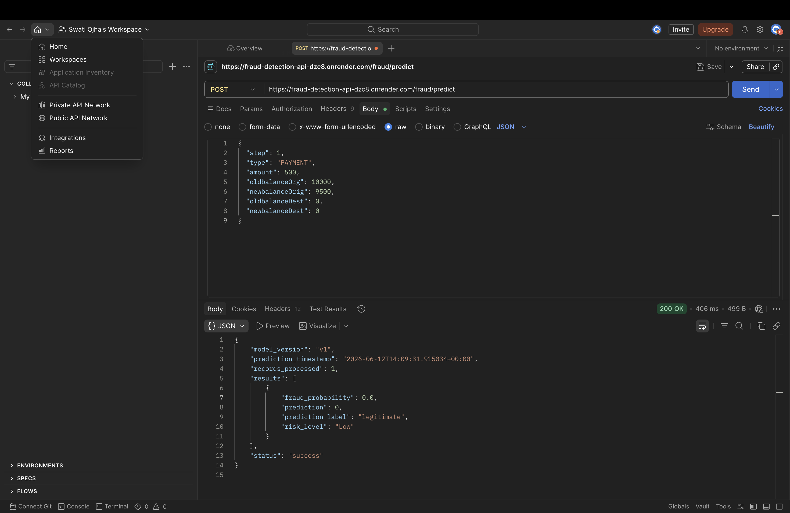

### Batch Prediction API Test

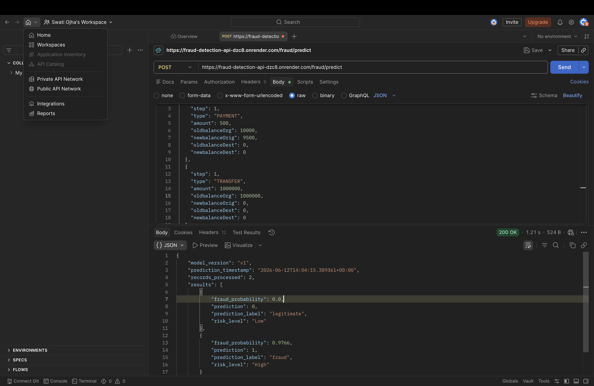

### Error Handling

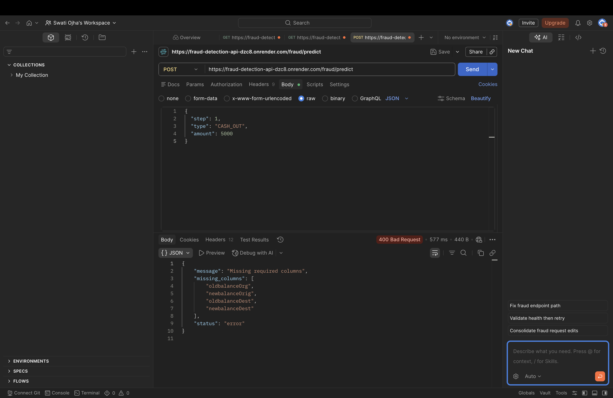

---

# Docker

## Build Docker Image

```bash
docker build -t fraud-detection-api .
```

## Run Docker Container

```bash
docker run -p 5001:5000 fraud-detection-api
```

The API will be available at:

```text
http://localhost:5001
```

---

## Health Check

```bash
curl http://localhost:5001/health
```

Example Response:

```json
{
  "status": "healthy",
  "model_version": "v1"
}
```

---

## Fraud Prediction

```bash
curl -X POST http://localhost:5001/fraud/predict \
-H "Content-Type: application/json" \
-d '{
    "step": 1,
    "type": "TRANSFER",
    "amount": 10000,
    "oldbalanceOrg": 20000,
    "newbalanceOrig": 10000,
    "oldbalanceDest": 0,
    "newbalanceDest": 10000
}'
```

---

# Tech Stack

## Machine Learning & Data Science

* Python
* Pandas
* NumPy
* Scikit-learn
* XGBoost
* SHAP
* Joblib

## Backend Development

* Flask
* REST API
* JSON Request/Response Handling

## Frontend Dashboard

* Streamlit

## Deployment & DevOps

* Docker
* Docker Compose
* Render
* Streamlit Community Cloud

## Visualization

* Matplotlib
* Seaborn

---

# Repository Contents

* Machine Learning Training Pipeline
* Feature Engineering Workflow
* SHAP Explainability Analysis
* Flask REST API
* Streamlit Dashboard
* Docker Configuration
* Automated Tests
* Deployment Assets

---

# Project Structure

Transaction Fraud Detection System

api/
    app.py

fraud/
    __init__.py
    fraud_model.py

artifacts/
    xgboost_fraud_detector.joblib

data/
    raw/

streamlit_app/
    app.py
    pages/
        single_prediction.py
        batch_prediction.py
        analytics.py
    utils/
        api_client.py

notebooks/
    EDA.ipynb
    model_training.ipynb
    shap_analysis.ipynb

tests/
    test_api.py
    test_model_inference.py

reports/
    figures/
    screenshots/

Dockerfile
Dockerfile.streamlit
docker-compose.yml
Procfile
runtime.txt
requirements.txt
README.md

---

# Deployment

### Streamlit Dashboard

Deployed using Streamlit Community Cloud.

### Flask API

Deployed using Render.

### Containerization

Dockerized for reproducible deployment and scalability.

---

# Key Learnings

* Handling highly imbalanced datasets
* Effective feature engineering for fraud detection
* Building interpretable ML systems using SHAP
* Designing production-ready REST APIs
* Integrating ML models with web applications
* Deploying ML systems to the cloud
* Containerization using Docker

---

# Future Improvements

* Real-time streaming predictions
* Model drift monitoring
* Authentication and API security layer
* CI/CD automation
* Prediction logging and monitoring

---

# License

This project is licensed under the MIT License.
